# Model-Distillery

**End-to-end model distillation pipeline**: synthetic SFT data generation → quality filtering → QLoRA training (with a logit-KD reference) → quantization → teacher-vs-student evaluation → serving configs.

The repo is built around one uncomfortable production truth: **a frontier teacher is 20–50x more expensive per token than a small model you own, and that gap is the entire business case for distillation.** Everything here exists to make the distillation decision *measurable* — data quality gates you can audit, a training plan you can cost before you rent a GPU, and a bench that tells you exactly how much quality you traded away and when the investment pays back.

Runs fully offline out of the box (`--offline` mode uses a deterministic mock teacher — no GPU, no API keys), and swaps to any OpenAI-compatible endpoint (vLLM, Ollama, OpenAI) for real runs.

## 🟢 New to AI? Read this first

**The problem, in human terms.** The biggest AI models are brilliant and shockingly expensive — imagine paying a world-class surgeon's hourly rate to ask someone for directions. Most everyday questions don't need the surgeon. But if you replace them with a cheap junior, quality collapses — unless the junior was **trained by watching the surgeon work**.

**What this project does.** Model-Distillery is that training program, end to end:

1. **Generate the textbook** — the big ("teacher") model answers thousands of prompts across six skill areas, written in different personas and styles so the lessons don't all look the same.
2. **Remove the junk** — near-identical answers are detected with a fingerprinting technique (MinHash) so one lesson isn't counted twenty times; broken or repetitive answers are filtered; a rejection step keeps only the best answer per question; and a 13-gram decontamination screen makes sure no exam question leaked into the textbook (otherwise the student's exam results would be a lie).
3. **Train the apprentice** — a recipe (QLoRA: train a small set of adapter weights on a memory-compressed base model, so a single GPU suffices) is emitted; without a GPU the pipeline produces a **costed training plan** instead — steps, memory, GPU-hours.
4. **Grade the apprentice against the master** — an exam compares student vs teacher per skill area, and a cost table shows exactly what you saved and when the training pays for itself at your monthly volume.

**Measured outcomes:** 114 automated tests pass offline in ~4.5s — including a hand-computed validation of the knowledge-distillation loss (the exact math a teacher's-grades-soften-a-student's-mistakes trainer uses), the fingerprint dedup catching planted near-duplicates, the leak screen catching a planted overlap, and a fully deterministic offline run: **122 candidates → 59 kept after quality gates → 46/12 train/val split → 68.6% retention**, byte-identical across runs. The two bugs the pipeline caught in its own data during the build are documented — that's the point of measurable gates.

```mermaid
flowchart LR
    subgraph Generation["1-2. Teacher layer"]
        PP["Prompt pool\n(6 capabilities)"] --> TR["TeacherRunner\npersona x temp x seed grid"]
        TR --> TC["LLMClient\nOpenAI-compat / EchoMock"]
    end
    subgraph Curation["3-5. Data curation"]
        TC --> DED["MinHash LSH dedup\n(banded, 0.8 Jaccard)"]
        DED --> F["QualityFilter\nrules + judge +\nrejection sampling (best-of-k)"]
        F --> DC["13-gram decontam\nvs eval corpus"]
    end
    subgraph Training["6-7. Training"]
        DC --> SPLIT["Stratified\ntrain/val split"]
        SPLIT --> PLAN["Training plan\ntokens / VRAM / GPU-hours"]
        PLAN -.-> QL["QLoRA run\n(NF4, optional)"]
        KD["logit-KD loss\nnumpy reference"] -.-> QL
    end
    subgraph Ship["8-9. Ship & measure"]
        QL --> Q["Quantize\nGGUF / AWQ builders"]
        Q --> B["StudentBench\nEM / token-F1 / containment\nx capability slices"]
        B --> C["Cost report\nretention % + breakeven"]
    end
```



## Quickstart

```bash
pip install -e .                       # stdlib + pydantic/httpx/numpy; no GPU needed

# Full offline pipeline on bundled demo data (61 prompts across 6 capabilities, incl. one planted duplicate for the dedup demo)
python -m distillery pipeline --offline --output-dir artifacts/run

# Training plan from any SFT JSONL
python -m distillery plan --input artifacts/run/03_sft_train.jsonl --output plan.md

pytest -q                              # 100% offline test suite
python -m ruff check src tests        # lint clean
```

Offline artifacts land in `artifacts/run/`: candidates, discard log, train/val JSONL, dataset report, training plan, bench report, cost report, and a `summary.json` with all key stats.

**Real teacher** (vLLM / Ollama / OpenAI — all OpenAI-compatible):

```bash
cp .env.example .env                   # set DISTILLERY_TEACHER_* variables
python -m distillery pipeline --output-dir artifacts/real
```

## Repository layout

```
src/distillery/
├── llm.py                  # LLMClient protocol; OpenAICompatClient; EchoMockClient (deterministic offline teacher)
├── config.py               # pydantic-settings (DISTILLERY_* env vars)
├── pipeline.py             # end-to-end orchestration + summary.json
├── cli.py / __main__.py    # `python -m distillery ...`
├── teacher/
│   ├── generate.py         # TeacherRunner: prompt pool x (persona, temp, seed) grid; CoT mode
│   ├── dedup.py            # MinHash signatures + banded LSH + Jaccard verification
│   └── filter.py           # rule gate, VerdictAI-compatible JudgeHook, rejection sampling
├── data/
│   ├── sft.py              # pydantic SFT chat schema, JSONL IO, stratified split
│   ├── decontam.py         # n-gram (default 13) decontamination vs eval corpus
│   └── report.py           # markdown dataset balance report
├── train/
│   ├── sft.py              # QLoRA configs, deterministic plan estimator, guarded torch recipe
│   └── kd.py               # T²·KL(student‖teacher) + α·CE — numpy reference + torch mirror
├── quantize/
│   ├── gguf.py             # llama.cpp convert + quantize command builder (runbook)
│   └── awq.py              # autoawq builder/runner (calibration-aware 4-bit)
├── eval/
│   ├── bench.py            # EM / token-F1 / containment / judge, capability slices
│   └── cost.py             # $/1M, monthly cost, breakeven, volume curve
├── serve/
│   ├── vllm_config.py      # `vllm serve` command + YAML descriptor
│   ├── ollama.py           # Modelfile + create/serve commands
│   └── openai_shim.py      # framework-free OpenAI-format handler + optional FastAPI app
└── data/                   # bundled demo_prompt_pool.jsonl + demo_eval_set.jsonl
scripts/build_demo_data.py  # regenerates the bundled synthetic data deterministically
tests/                      # fully offline pytest suite
```

## Design decisions (and their trade-offs)

### 1. Three distillation regimes — data distillation vs logit KD vs on-policy

| Regime | What the student learns from | Wins when | Loses when |
| --- | --- | --- | --- |
| **Data distillation** (this repo's spine) | Teacher *outputs* on a curated prompt distribution | You need an inspectable, reusable dataset; teacher logits are unavailable (closed APIs); multi-teacher mixes | The prompt distribution drifts from deployment traffic; long-tail reasoning that text alone can't carry |
| **Logit KD** (`train/kd.py`) | Teacher's full next-token distribution | You own both models and want dense per-token signal from small data; compression of a same-family model | Teacher is API-only (no logits); teacher and student tokenizers differ (cross-tokenizer KD is its own research project) |
| **On-policy distillation** | Student's own rollouts, scored/corrected by teacher | Chat/agentic behavior where exposure bias dominates; RFT-style settings | You need controllable data lineage; generation cost of student rollouts is the bottleneck |

This repo implements data distillation end-to-end and ships logit-KD as a tested reference loss, because the two compose: KD needs (student, teacher) *on the same tokenized inputs*, which a curated SFT set already provides. On-policy is roadmap (see below) — it needs a rollout loop and a verifier, a different infrastructure tier.

### 2. Why MinHash dedup (and not embedding clustering)

Duplicates are not just waste — in rejection-sampling pipelines the same high-scoring answer recurs across seeds, and training on k copies of one answer biases the student toward that phrasing (diversity collapse). Exact-hash dedup misses near-duplicates; embedding clustering is O(n²) unless you add ANN infrastructure and its similarity threshold is harder to reason about. MinHash + banded LSH is the sweet spot:

- **O(n) expected** candidate generation via banding — probability a pair with Jaccard `J` collides is `1 - (1 - J^r)^b` (r rows per band, b bands). Defaults (128 perms, 16 bands × 8 rows) put the S-curve midpoint at J ≈ 0.71 and catch J = 0.8 pairs ~95% of the time *per pass*; exact Jaccard verification then makes reported precision exact.
- **Tunable, interpretable threshold**: Jaccard on word shingles is a number a reviewer can argue about; cosine of an opaque embedding is not.
- Pure python here (numpy-free) so the algorithm is auditable; for >1M rows swap in `datasketch`/MinHashLSH on Redis or `text-dedup` — the interface (`DedupItem` in, `DedupResult` out) stays.

Trade-off: MinHash targets *near-verbatim* similarity. Semantic paraphrase dupes ("revenue up 4%" vs "sales grew 4%") pass through — for SFT that's often desirable (paraphrase diversity is signal), but it's a known boundary.

### 3. Why 13-gram decontamination

Benchmarks contaminated by training data are the quiet killer of distillation projects: the student scores well *because it memorized the eval answers*. Verbatim n-gram overlap against the eval corpus is the standard screen (GPT-3/PaLM-lineage use 13 tokens):

- **13 is long enough that a match is almost never chance** — a specific 13-token span recurring in fluent English is either copying or a template; both are disqualifying — and short enough to catch partial rewording that reuses a distinctive span.
- Cheaper and more defensible than embedding-similarity decontamination, which produces a threshold you must defend per dataset; 13-gram hits come with *evidence* (the exact span, the eval doc), which is what an audit wants.
- Here the screen runs **before the train/val split**, on prompt+response text, against every eval case (instruction+input+reference).

Trade-off: verbatim matching misses translated/paraphrased leakage; a production system would add an embedding-similarity second stage. Also: decontaminate against *your* eval set and any public benchmarks you report on, and re-run it last — after any late data additions.

### 4. Why rejection sampling (best-of-k)

Given k candidates per prompt from the teacher grid, keep the best by judge score and keep the *discard-reason histogram*. Rationale:

- Quality per prompt is cheap to buy with sampling: pass@k on a fixed prompt distribution converts teacher entropy into a quality selection step. The cost is k× generation on the teacher, which is exactly the spend you're amortizing anyway — better to spend tokens at generation time than ship noise into training.
- The **discard histogram is the real product**: `rule:length`, `rule:repetition`, `rule:language`, `rejection_sampling`, `no_valid_candidate` — a data-quality dashboard, not a silent filter. If `rule:repetition` spikes after a teacher upgrade, you know within one run.
- Rules (deterministic, free) gate validity; the judge only *ranks* survivors. Mixing the two (judge as gatekeeper) couples your dataset to a score distribution you don't control.

Trade-off: best-of-k optimizes the judge, so a miscalibrated judge systematically distorts the dataset (Goodhart). The `JudgeHook` protocol exists so you can swap the offline heuristic for an LLM judge — and should validate that swap against a human-labeled slice first.

### 5. QLoRA, briefly (what the plan mode estimates)

QLoRA makes "train your own student on one GPU" arithmetic work:

- **NF4 quantization**: base weights frozen in 4-bit NormalFloat. NF4 is information-theoretically matched to the normal distribution of trained weights (quantiles of N(0,1) as codebook), so at 4 bits it beats uniform INT4 on perplexity for the same bitrate.
- **Double quantization**: the FP32 per-block scale constants themselves get quantized (FP32 → 8-bit, with a second-level scale), saving ~0.4 bits/param — ~3 GB on a 70B — at negligible error.
- **LoRA on top**: backprop and AdamW states only exist for the adapters (r=16 on q/k/v/o here: ~0.25% of params). That's why the plan's memory model is `0.55 B/param base + ~12 B/LoRA-param optimizer state + activations`, and why a 7B student fits in ~6–8 GB while full fine-tuning needs ~112 GB+.
- **Paged optimizer** (flag in the torch recipe) spills optimizer states to CPU RAM on spikes — the difference between a run that OOMs at step 900 and one that doesn't.

The plan generator turns dataset size into steps, tokens, a per-model-size VRAM table, and GPU-hours — all deterministic and testable, so you can put a cost ceiling on training *before* renting.

### 6. The cost curve

`eval/cost.py` renders the argument that justifies the whole repo: teacher `$/request` vs student `$/request`, monthly savings at your volume, and the breakeven horizon for the one-time investment (generation + training + eval). Savings scale linearly with volume; investment is fixed — at demo pricing ($3/$15 per 1M teacher tokens vs $0.15/$0.60 student) and 100k requests/month, a $60 investment breaks even in well under a month. The decision hinge is never cost alone — it's the **quality retention %** from the bench weighed against that payback curve.

## Configuration reference

| Env var | Default | Meaning |
| --- | --- | --- |
| `DISTILLERY_TEACHER_BASE_URL` | `http://localhost:8000/v1` | OpenAI-compatible teacher endpoint |
| `DISTILLERY_TEACHER_API_KEY` | `sk-local` | Bearer token |
| `DISTILLERY_TEACHER_MODEL` | `demo-teacher` | Teacher model id |
| `DISTILLERY_STUDENT_BASE_URL/_API_KEY/_MODEL` | teacher values | Student endpoint for benching |
| `DISTILLERY_REQUEST_TIMEOUT` | `60` | Per-request timeout (s) |
| `DISTILLERY_CONCURRENCY` | `8` | Max in-flight teacher requests |

Pipeline flags: `--offline`, `--output-dir`, `--input`, `--eval`, `--k` (candidates per prompt), `--limit`. Training dataclasses (`LoRAConfig`, `QuantConfig`, `TrainingConfig`) live in `train/sft.py` and are the single source of truth for both the plan and the torch recipe.

## Testing

The suite is **offline by construction**:

- `EchoMockClient` is a seeded deterministic teacher (same seed+prompt → same text), so generation, filtering, and the pipeline are reproducible; a `fidelity` parameter simulates a weaker student for the bench delta.
- `OpenAICompatClient` is tested against `httpx.MockTransport` (including SSE streaming) — real HTTP semantics, zero network.
- The numpy KD loss is checked against a **hand-computed 2-class × 2-token example** (arithmetic in the test docstring), including `ignore_index` masking.
- The pipeline test asserts flow-conservation identities (candidates = dedup + discards + kept, kept = decontam + train + val) plus a snapshot of key stats, not whole files.
- Quantization/serve modules only build commands; the heavy torch path is behind guarded imports and raises `DependencyMissingError` with install hints.

```bash
pytest -q            # 115 tests, no network, no GPU
python -m ruff check src tests
```

## Production notes

- **Serving**: AWQ + vLLM for GPU throughput (`serve/vllm_config.py`; watch `--max-model-len` — KV cache grows linearly with it), GGUF + llama.cpp/Ollama for CPU/edge (`serve/ollama.py`). `--enable-prefix-caching` is free latency for chat traffic with a static system prompt.
- **Merging before quantization**: merge LoRA (`merge_and_unload`) before GGUF/AWQ; quantizing an unmerged adapter is unsupported.
- **Calibration data for AWQ**: use prompts from the same distribution you distilled on — the prompt pool itself is a good calibration set.
- **Ordering matters**: dedup → filter → decontaminate → split. Splitting last means the val set never sees a near-duplicate of a train item, and decontamination runs against eval data that is already final.
- **Monitor the discard histogram** across runs; it is your earliest warning that teacher or prompt quality moved.

## Honest limitations

- The offline teacher is a **mock**: it produces structurally realistic, deterministic text — not true task performance. Judge scores and bench metrics in `--offline` mode validate *machinery*, not model quality.
- The heuristic judge is lexical, not semantic; it rewards structure and overlap and would be Goodharted by a model tuned against it. Swap in an LLM judge via `JudgeHook` for real runs.
- The KD loss is a **reference implementation**: correct and tested in numpy, but the torch training loop that would exercise it is not wired into `run_qlora_training` (which trains SFT-only via HF Trainer) — wiring KD into a collator+Trainer pair is roadmap work.
- Quality-filter heuristics (stopword-based language check, char-length bands) are English-centric.
- MinHash dedup operates on word shingles: semantic paraphrase duplicates pass through by design.
- The demo price points are illustrative constants, not quotes; override `ModelPrice` for real analysis.

## Roadmap

- On-policy distillation loop (student rollouts + teacher/verifier scoring).
- Wire logit-KD into the torch Trainer (KD collator over paired student/teacher logits).
- Embedding-based decontamination as a second stage; multilingual filter rules.
- DPO/ORPO stage on top of rejection-sampled preference pairs (best-vs-worst per prompt).
- `datasketch`/Redis backend for billion-scale dedup; `text-dedup` adapters.
- Continuous eval in CI: bench a candidate student against the golden set on every dataset change.

## License

MIT — see [LICENSE](LICENSE).
